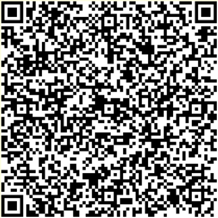

# Taiwan DCC Verifier Core


<p align="center">
  <a href="#about">About</a> •
  <a href="#how-to-start">How to Start</a> •
  <a href="#qr-code-sample">QR Code Sample</a> •
  <a href="#licensing">Licensing</a>
</p>

## About

數位新冠病毒健康證明查驗程式（以下簡稱查驗程式）由衛生福利部開發，提供驗證 EU-DCC 數位證明之需求。查驗範圍包含疫苗數位證明、檢驗數位證明及康復數位證明，能協助特定場所快速區分民眾染疫風險，有效防範社區群聚感染，降低可能衝擊。

本 Repository 中包含查驗程式核心功能之原始碼，程式可獨立運行與打包。基本原則說明如下：

- [x] 符合歐盟 GDPR（General Data Protection Regulation）規範

  ● 不保留民眾任何個人資料。

  ● 可離線驗證數位證明 QR Code。

- [x] 符合歐盟憑證交換機制

  ● 具備數位簽章檢核，可有效防偽。
  
  * 因應 EU DCC Gateway 規範，此開源版本僅提供台灣測試環境（TST environment）憑證及其對應之數位證明 QR Code Sample，做為示範使用。

- [x] 使用端不需安裝專屬 App

  ● 查驗程式採 Flutter Web 開發，可於瀏覽器迅速開啟、使用

  ● 支援 PWA（Progressive Web App）技術，提供等同於 App 的操作體驗。


## How to Start

1. Clone project to local

    ```bash
    git clone https://github.com/twdcc/verifier_core.git 
    ```

2. Install [Flutter](https://flutter.io/docs/get-started/install)

    * require latest flutter master channel.

3. Enable FFW(Flutter for Web)

    ```bash
    flutter config --enable-web
    ```
4. Run

    ```bash
    flutter run -d Chrome
    ```
5. Build

    ```bash
    flutter build web --web-renderer html
    ```
    
    
## QR Code Sample

● Vaccine



● Test


## Licensing

```
MIT License

Copyright (c) 2021-2022 Taiwan Centers for Disease Control

Permission is hereby granted, free of charge, to any person obtaining
a copy of this software and associated documentation files (the
"Software"), to deal in the Software without restriction, including
without limitation the rights to use, copy, modify, merge, publish,
distribute, sublicense, and/or sell copies of the Software, and to
permit persons to whom the Software is furnished to do so, subject to
the following conditions:

The above copyright notice and this permission notice shall be
included in all copies or substantial portions of the Software.

THE SOFTWARE IS PROVIDED "AS IS", WITHOUT WARRANTY OF ANY KIND,
EXPRESS OR IMPLIED, INCLUDING BUT NOT LIMITED TO THE WARRANTIES OF
MERCHANTABILITY, FITNESS FOR A PARTICULAR PURPOSE AND
NONINFRINGEMENT. IN NO EVENT SHALL THE AUTHORS OR COPYRIGHT HOLDERS BE
LIABLE FOR ANY CLAIM, DAMAGES OR OTHER LIABILITY, WHETHER IN AN ACTION
OF CONTRACT, TORT OR OTHERWISE, ARISING FROM, OUT OF OR IN CONNECTION
WITH THE SOFTWARE OR THE USE OR OTHER DEALINGS IN THE SOFTWARE.
```
